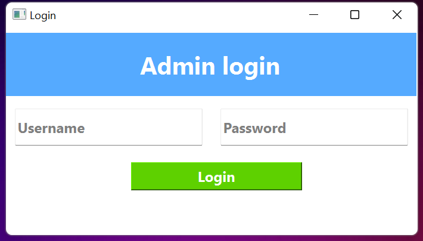
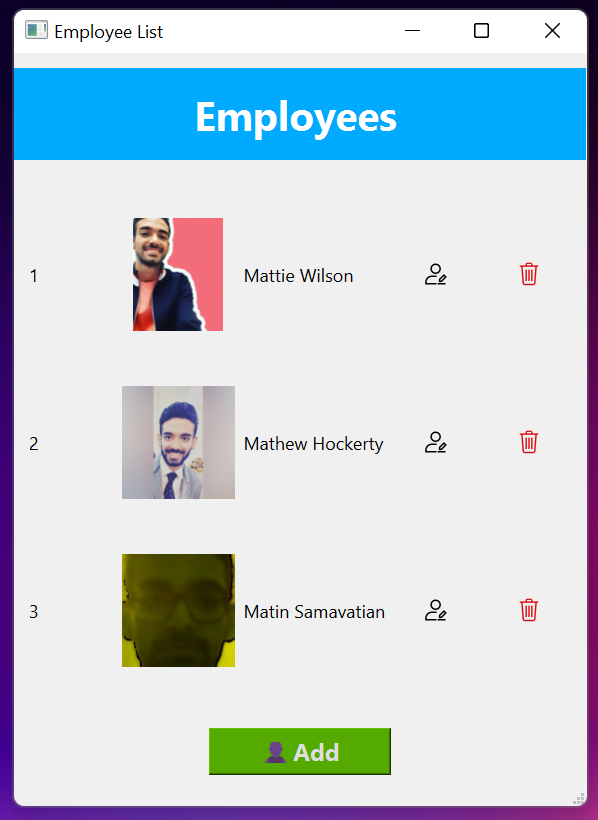
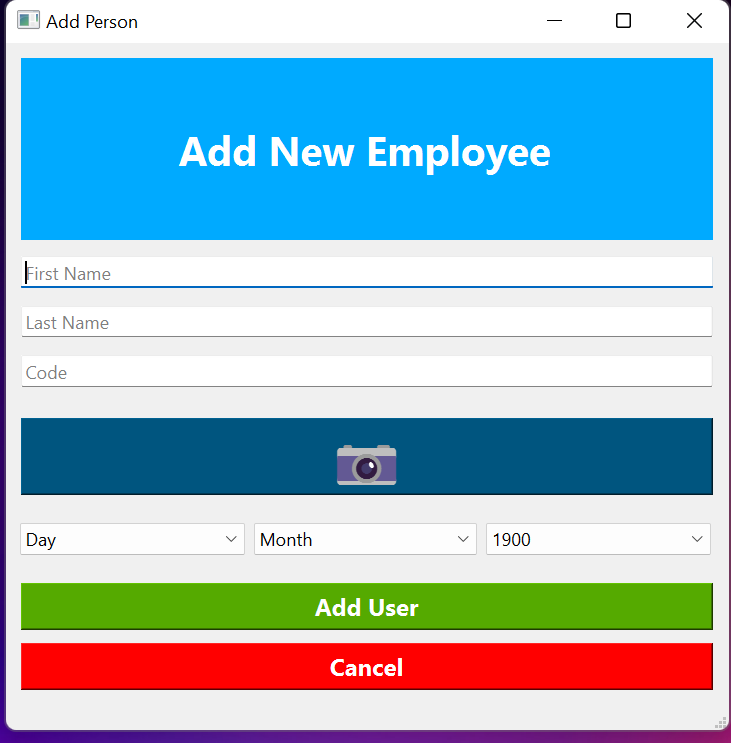
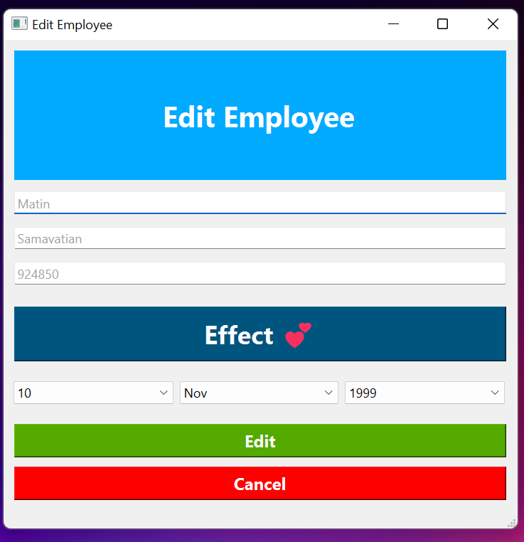

## Employees Management System (sample)
- A user manager written in **python** using **sqlite**, **opencv**, **PySide6**, **Numpy**.
- Administor Login:
  - Secure Admin Login profile defined in database.
> 

- User List:
  - Add, Edit or Delete Employees.
> 

- Add Employee:
  - Simply add employees with firstName LastName nationalCode and their birthday.
> 

- Camera:
  - Instantly take a picture for employee's avatar.
> 

- Filter:
  - 9 filter for employee's avatar.
> 

- Edit Employee:
  - Edit employee profile.
> 

